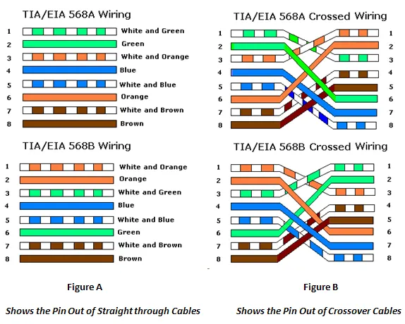
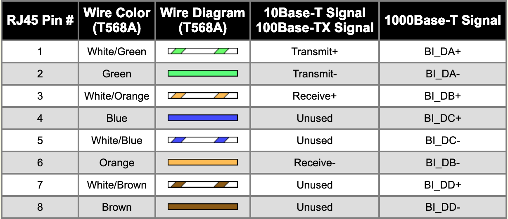
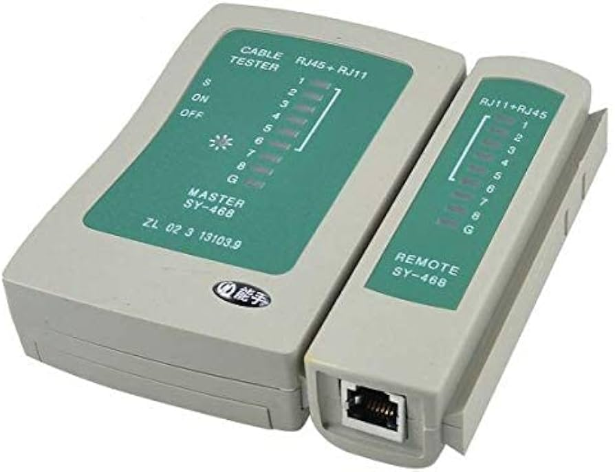
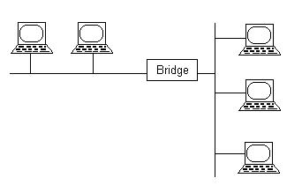
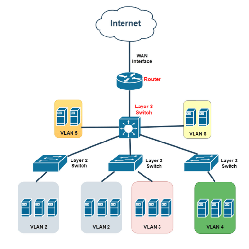
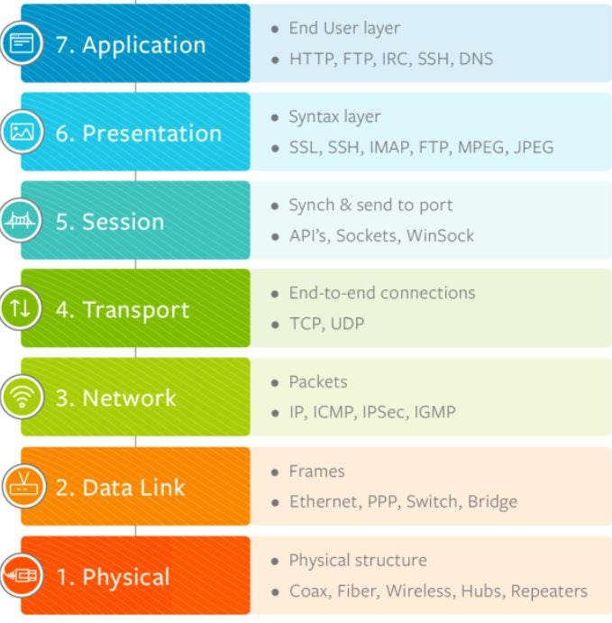
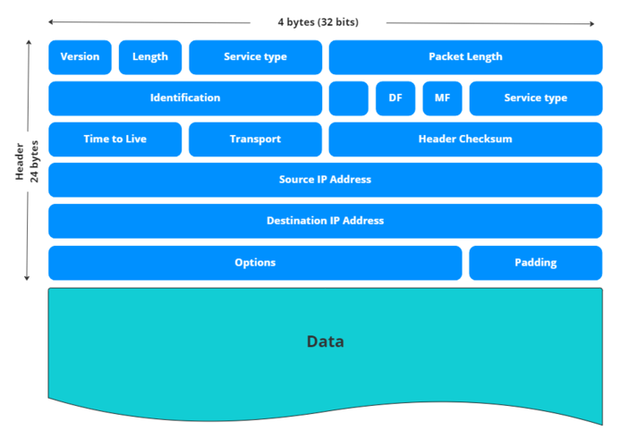
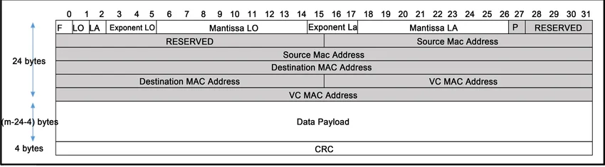

# Things that was mentioned during the session
---
## Topics
- RJ45 straight / crossover connection
- RJ45 color codes A(T568A)/B(T568B)

  
---
- ethernet protocol use pins 1-2-3-6

  
---
- RJ45 pins connection tester [Youtube](https://www.youtube.com/watch?v=y3DmOPrmBio)

  
---
- osi layer 2 (data link): switch /bridge

  
---
- osi layer 3 (network): switch

  
---
- osi layer 6 (presentation): ssh protocol

  
---
- ip address for final destination

  
---
- mac address for next hop

  
---
- vlans (tags/id)

  
---
- draw i/o network diagram [Draw io tutorial](https://www.drawio.com/docs/diagram-types/network-diagrams/)
  
---
- cisco & hp switch layer 3 commands 
[Cisco IOS Configuration Fundamentals Command Reference](https://www.cisco.com/c/en/us/td/docs/ios-xml/ios/fundamentals/command/cf_command_ref.html)
  
